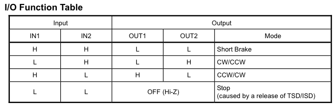

# MSoRo
This repository documents the design, fabrication, and control of a modular soft robotic system MSoRo capable of reconfiguration into a ball. The repository was originally used for "Topology and Morphology Design of Spherically Reconfigurable Homogeneous Modular Soft Robots," as [published in Soft Robotics](https://www.liebertpub.com/doi/10.1089/soro.2021.0125). This paper can be cited as follows:

C. Freeman, M. Maynard, and V. Vikas, “Topology and Morphology Design of Spherically Reconfigurable Homogeneous Modular Soft Robots,” Soft Robotics, vol. 10, Jul. 2022, doi: 10.1089/soro.2021.0125.

The arXiv version can be accessed [here](https://arxiv.org/abs/2205.00544).  

The accompanying YouTube video can be accessed [here](https://www.youtube.com/watch?v=K-ZRhlJ1r1A).

The related GitHub repository that includes MATLAB code to optimize the limb shape for the robot can be found [here](https://github.com/clfreeman7/Design_Optimization).

This repository is also used in the following papers:
- Freeman, C., Conzola, J., and Vikas, V. (April 28, 2023). "Topology Design and Optimization of Modular Soft Robots Capable of Homogenous and Heterogenous Reconfiguration." ASME. J. Comput. Nonlinear Dynam. June 2023; 18(6): 061007. https://doi.org/10.1115/1.4062265
- A. N. Mahendran, C. Freeman, A. H. Chang, M. McDougall, P. A. Vela and V. Vikas, "Multi-Gait Locomotion Planning and Tracking for Tendon-Actuated Terrestrial Soft Robot (TerreSoRo)," 2023 IEEE/RSJ International Conference on Intelligent Robots and Systems (IROS), Detroit, MI, USA, 2023, pp. 2542-2549, https://doi.org/10.1109/IROS55552.2023.10341926.
- C. Freeman, A.N. Mahendran, and V. Vikas, [“Environment-centric learning approach for gait synthesis in terrestrial soft robots,”](https://arxiv.org/pdf/2402.03617) in IEEE Transactions on Robotics (T-RO), 2025.

## Overview
The design and fabrication have undergone countless iterations and improvements. This repository generally details the preliminary design and fabrication as documented in 2019. This consisted of two main designs for: 1) an external Arduino Uno controlled and 2) an embedded Arduino Nano controller. The original design for the external Arduino Uno is shown below without the hub cap to show the internal mechatronics:

The same robot with an embedded Arduino Nano in the hub is shown below:

Finally, the Arduino Uno design with the hub cap and a tether attached is shown here:

## Fabrication
### Mechatronics
The basic mechatronics for the MSoRo system consist of a microcontroller, DC motors, and motor drivers. The current prototype consists of the following:
- One (1) [Arduino Uno Rev3](https://store.arduino.cc/usa/arduino-uno-rev3)
- Four (4) maxon DC Motors (273687,1105182-05 Rev. E)*
- Four (4) TOSHIBA Full-Bridge DC Motor Driver IC ([TB6643KQ8](https://toshiba.semicon-storage.com/ap-en/semiconductor/product/motor-driver-ics/brushed-dc-motor-driver-ics/detail.TB6643KQ.html))

\*  *These motors were purchased from eBay. However, the corresponding datasheets are propietary to the maxon company and we do not have access to them. We typically run these motors at about 15-20 V.* 

A basic circuit schematic is shown below:

#### Alternative Components
The same mechatronics design and code can be used with other components as well. We have also used the following:
- One (1) [Arduino Nano](https://store.arduino.cc/usa/arduino-nano)
- One (1) [Arduino Nano 33 IOT] (https://store.arduino.cc/usa/nano-33-iot), with built-in Bluetooth connectivity
- Four (4) [Faulhaber Minimotor SA 1219 E 015 G](https://www.faulhaber.com/en/products/series/1219g/)*

#### Motor Considerations
Given our use of "bang-bang control" (where actuators are only either on or off), the motors used do not have to be servomotors or have encoders. Thus, motors should be chosen to satisfy desired size and torque requirements. We found that Faulhaber motors were slower but could provide more torque. 

#### Alternative Configruations
We have parameterized our control code such that different actuator configurations and quanitites do not require significant changes to the code. For a robot with a different number of actuators, simply change the constant parameter in the setup portion of the code. The control code is independent of the morphology or configuration of the robot. Rather, the number of motors determines the number of possible robot states (i.e., the total number of on/off motor combinations) and labels them. The user can then input a desired sequence of on/off combinations to control the robot.

#### Motor Driver Details
For the TB6643KQ motor driver used in this example, the pins are defined in the datasheet as follows:

The code relies on the following input/output logic from the datasheet (H = high/ 1 ; L = low / 0).

## Code
The basic code presented [here](BasicMSoRo.ino) enables open-loop control of a motor-tendon actuated robot by cycling through a predetermined input sequence (i.e. locomotion gait). 

### Flow
This basic code was written in the [Arduino IDE](https://www.arduino.cc/en/main/software), a free, open-source software based on C and C++. This allows us to control the direction and timing of the motors by using an Arduino microcontroller.

### User-defined Parameters
The code requires a minimum of five initial parameters: the number of motors, the motor pin numbers, the desired input cycle, the transition time constant, and the motor unspooling time constant. 
#### Number of Motors
This code works for any number of motors by assuming band-bang control (i.e. the motors are always either on or off with no in-between states). This allows us to label discrete robot states by considering all of the possibleo on/off combinations. If intermidiate states are desired (e.g., half-curled robot limbs), this can be altered in the initializations. 
#### Motor Pin Numbers
Here, the user can input the digital Arduino pin numbers that are connected to the motor driver inputs. For this to work properly, the motor terminals should be grouped together. For instance, for three motors, the array should be {Motor 1 Pin A, Motor 1 Pin B, Motor 2 Pin A, Motor 2 Pin B, Motor 3 Pin A, Motor 3 Pin B}.
#### Desired Input Cycle
#### Transition Time Constant
The transition time constant is the total time it takes for the robot to transition between two states in milliseconds. This may differ from the actual total transition time constant due to small delays in the microprocessing, but it should be fairly close. 
#### Motor Unspooling Time Constant
It is sometimes helpful to add a short period of motor unspooling (reversing the motor direction) when trying to uncurl / relax an actuator. If desired, this can be input in milliseconds. If this is not desired, this can be initialized as 0. 

## Testing the Code

### Setup
Before uploading a sketch to the Arduino to run the code, the user must first ensure that they have selected the correct port and board. The port name depends on the computer's operating system and which USB port is being used. The selected board must correspond to the Arduino model being used, as shown in the picture below. 

Note that newer models or third-party models (such as the Adafruit Feather) require downloading a separate core through the Boards Manager. The Nano 33 IoT core can be downloaded [here](https://www.arduino.cc/en/Guide/NANO33IoT). 
### Breadboard
Although this code will run on a soldered PCB corresponding to the provided circuit schematic, it is often convenient to use a breadboard during early testing. Below is a picture of an example breadboard: 

Note three differences between this breadboard and the circuit schematic:
1. The motors are not included. 
2. LEDs and resistors have been added to the input pins of the motor drivers. 
3. The external power supply is not included. 

These changes are to allow the user to test the code without needing to actually use the motors or power supply. The LEDs will light up to indicate that current is flowing through the motor driver. Once the desired code changes have been tested, the user can then add the external power and motors. The LEDs maybe included or removed at this point, as they will not affect the circuit greatly. 
